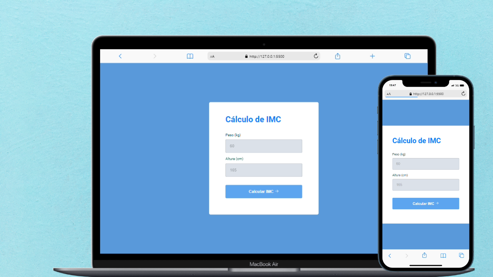

<h1 align="center"> Cálculo de IMC </h1>

Programa de treinamento e acompanhamento para Ana.  

  <a href="#-tecnologias">Tecnologias</a>&nbsp;&nbsp;&nbsp;|&nbsp;&nbsp;&nbsp;
  <a href="#-projeto">Projeto</a>&nbsp;&nbsp;&nbsp;|&nbsp;&nbsp;&nbsp;
  <a href="#memo-licença">Licença</a>

 

  

## 🚀 Tecnologias

Esse projeto foi desenvolvido com as seguintes tecnologias:

- HTML e CSS
- JavaScript
- Git e Github
- Figma

## 💻 Projeto

O Cálculo de IMC é um treinamento para ensinar meus primos e minha namorada sobre programação, o projeto original foi oferecido pela Rockseat.

- [Acesse o projeto finalizado, online](https://ThiagoMDantas.github.io/imc)

- [Assistir aulas](https://lp.rocketseat.com.br/imc)

## :memo: Licença

Esse projeto está sob a licença MIT.

---

Feito com ♥ by Rocketseat :wave: [Participe da nossa comunidade!](https://discord.gg/rocketseat)